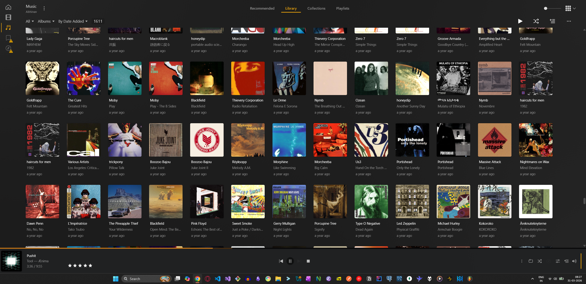

# audio-tools
A collection of code snippets of some basic tools that I use every now and then while learning Audio DSP

# A note (I keep updating this like a log)
If you want to know what this repository contains, please go through ROADMAP.md

<b>--- 31-03-2026 08:08 TUESDAY ---</b>
  
I have been into audio all my life. From experimenting with music production in FL Studio when I was around 13-14, to using VirtualDJ (controlling it with my keyboard and mouse) to eventually getting my very own Pioneer DDJ-RB for my birthday, I have been involved in audio in a lot of ways. I remember creating my own Soundcloud account, my own Mixcloud account (and getting followed by Beatport Top 100 for my DJ mixes - which was a big deal for me as a kid - you can find that profile [here](https://www.mixcloud.com/BreakLoose/)) and trying to become a creator overall in the field of Audio.

Now that I'm 24, I have invested quite a bit into my audio listening equipment and have started to really mature and understand the technicalities of it. I maintain a humble Plex library which contains around 1600+ albums (as of now) spanning acorss multiple genres (mostly metal).

From soundstages to imaging, from pictorial representations in my head to God, I have a very intimate relationship with audio. This repository was created for me to really hold myself accountable and actually start creating things instead of just consuming. 

While this repository was created almost 2 months ago, I have really started to contribute to this since the last 15 days. My goal here is to really get into this domain and finally be able to try to represent sound the way I hear and see it (which is why I am also trying to work on a visualizer - [Physics Engine](https://github.com/abhinavp06/physics-engine)).

I have 3 main goals:
- Work on IEMs - Career/Life
- Work on Audio Plugins - Leisure
- Work on my own Audio Codec - Intellect

These goals also relate to how I perceive life in general (which is a journey of it's own and you can find it here - [The Philosopher's Window](https://tpw.co.in))

**NOTE FOR RECRUITERS:** Anyways, if you are a recruiter, I am sure I must have sent this repository to you. I request you to go through it.

Later.

<b>P.S.</b> My Plex Library:
